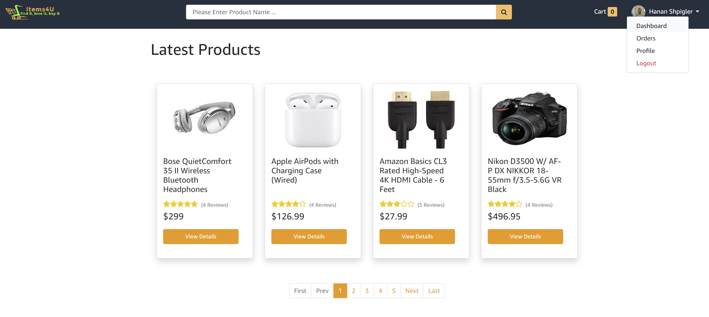
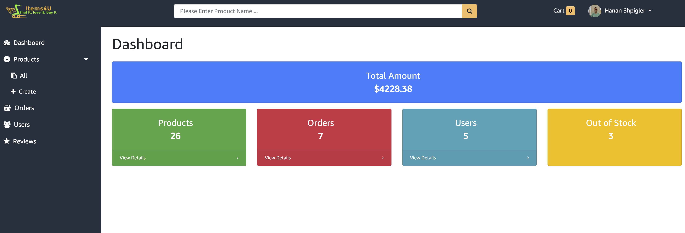
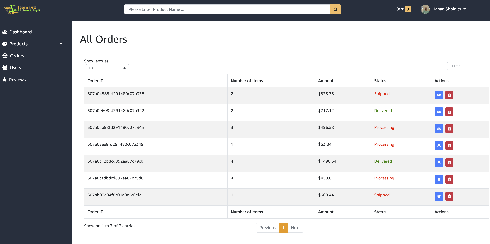
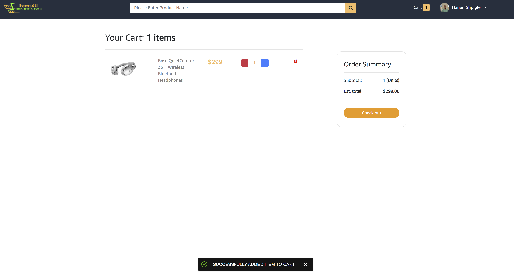
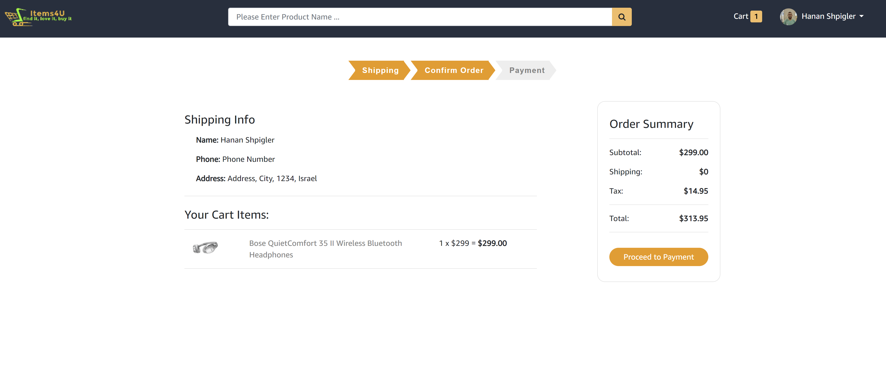

# Items4U
An online E-commerce site that includes a wide range of options like:
Buy, Add New Products, Existing Product Gallery, Add Comments/Reviews, Advanced Search by Category,Price Range and Reviews.
#### And lots of other things !!

# Instructions
- Download the folder and install dependencies with npm i
- Fill in the missing details in the ENV file inside config folder.
- Open 2 terminals (1 for backend, 1 for frontend)
- In the backend type npm run prod to run in production mode / dev to run in development mode.
- Navigate to the frontend folder with cd /frontend and type start.

 ###### 🛍️ Enjoy Shopping Online ! 🛍️ ######
